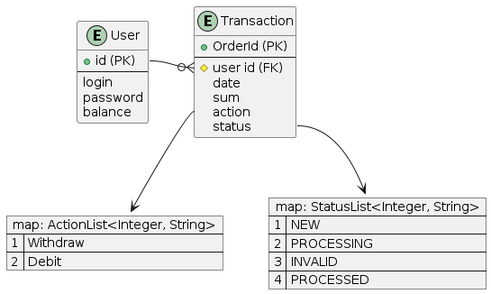
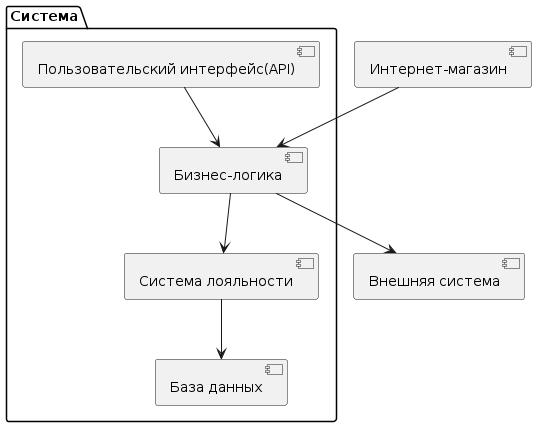
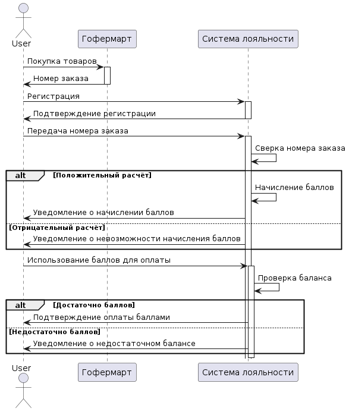

# go-musthave-diploma-tpl

Индивидуального дипломного проекта курса «Go-разработчик»

1. Описание основных сущностей и связей между ними ( ER-диаграмма)
2. Список логических компонентов системы и схема из зависимостей друг от друга (общая архитектура решения)
3. Диаграмма последовательностей (sequence-диаграммы): для операции начисления балов - отразить взаимодействие с внешней системой), для операции снятия с баланса.

# ER-диаграмма

# Список логических компонентов системы
## Пользовательский интерфейс (UI):
    - Этот компонент отвечает за взаимодействие с пользователем.
    - Зависит от бизнес-логики для обработки запросов и отображения данных.

## Бизнес-логика (Business Logic):
    - Этот компонент содержит основные правила и процессы бизнеса.
    - Включает в себя регистрацию пользователей, управление транзакциями, расчет баллов лояльности и тд.
    - Зависит от системы лояльности и внешней системы для расчета и начисления баллов.

## Система лояльности (Loyalty System):
    - Этот компонент управляет баллами лояльности и связанными с ними операциями.
    - Зависит от базы данных для хранения данных о пользователях и их балансах баллов.

## Внешняя система (External System):
    - Этот компонент представляет собой внешнюю систему, с которой взаимодействует система лояльности для проверки номера заказа и возможно других операций.
    - Зависит от внешних API для обмена данными с внешней системой.

## База данных (Database):
    - Этот компонент отвечает за хранение данных о пользователях, заказах, баллах лояльности и другой связанной информации.
    - Другие компоненты зависят от базы данных для доступа к данным.

## Интернет-магазин (Online Store):
    - Этот компонент представляет собой интернет-магазин, где пользователи совершают покупки.
    - Взаимодействует с бизнес-логикой для передачи заказов и получения информации о начисленных баллах.

# Диаграммы последовательностей

# Запуск программы
make up